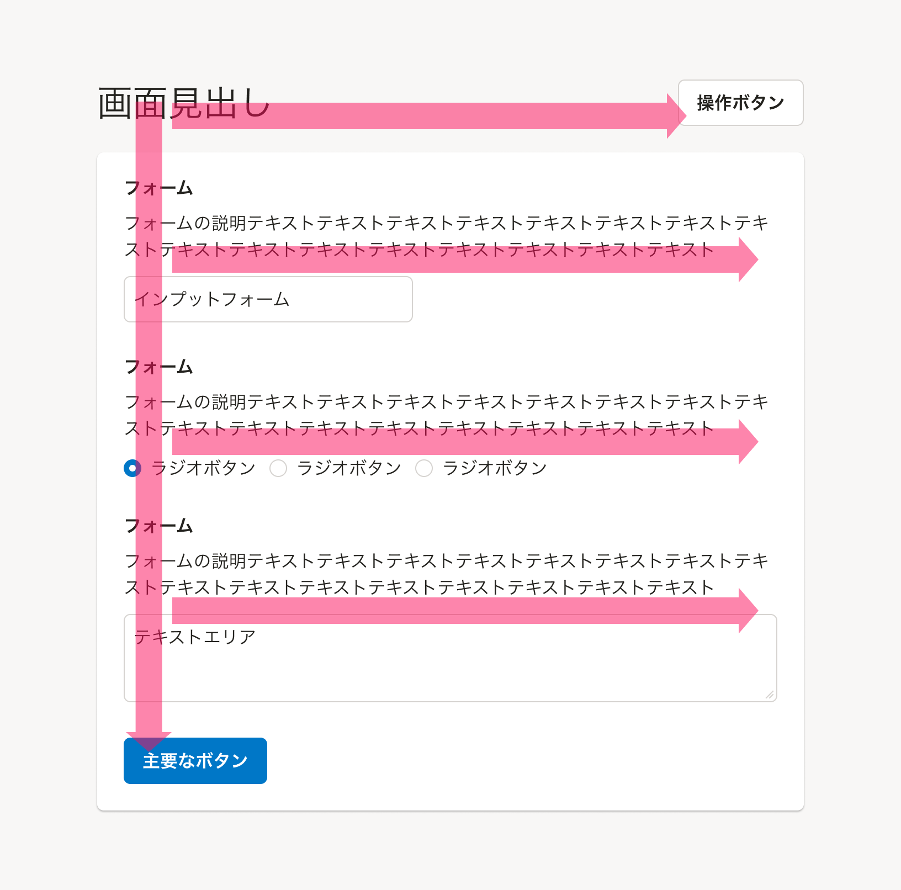
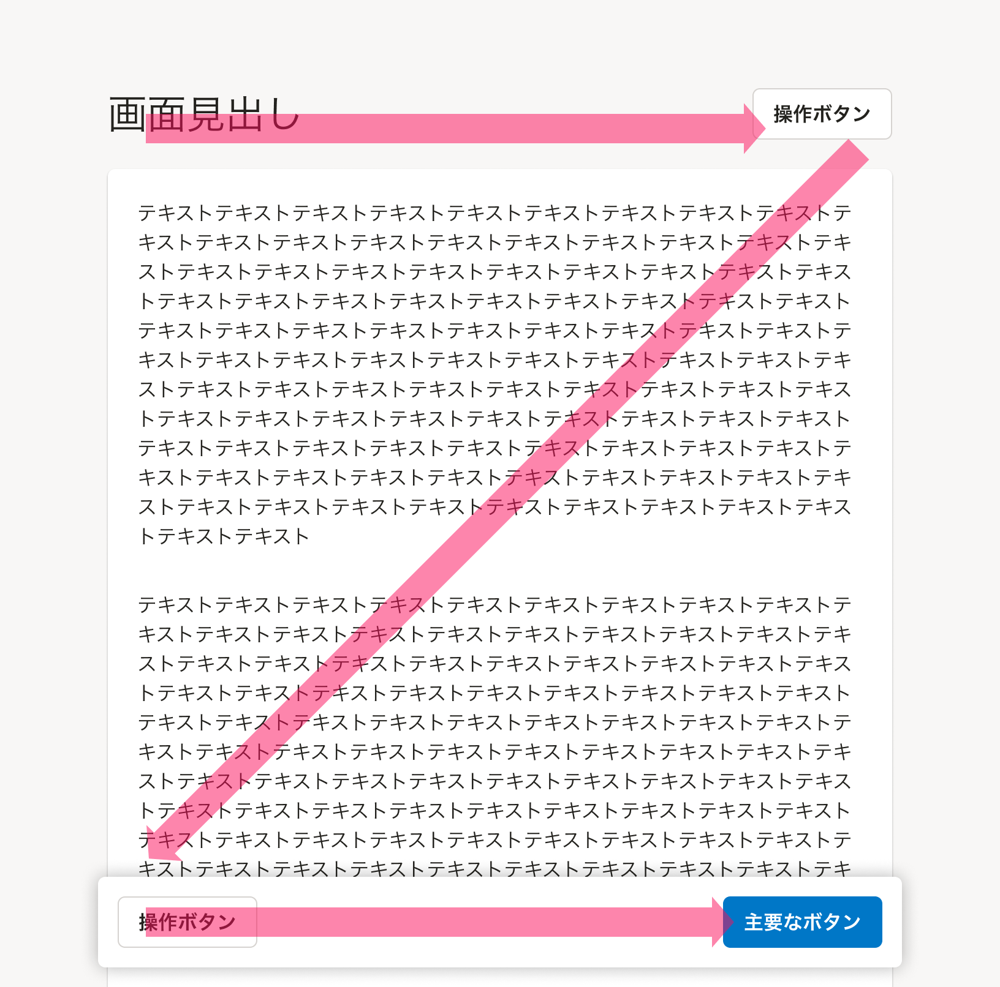
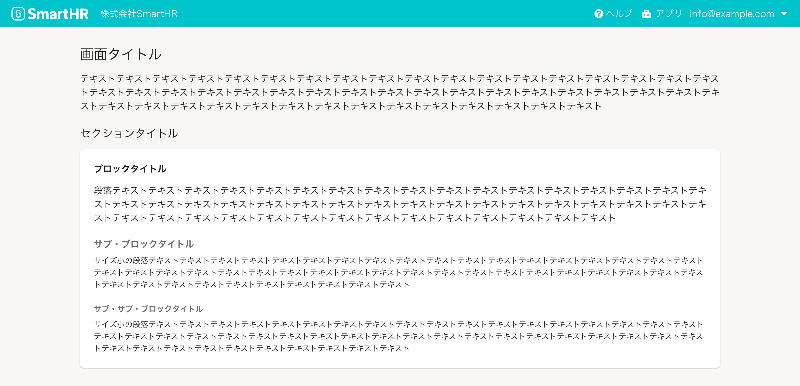
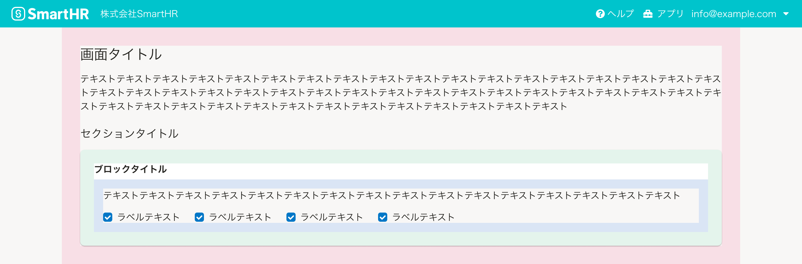

視線誘導の法則を考慮したレイアウトの基準や注意点をまとめています。

## 視線誘導とは
視線誘導とは、ビジュアルデザインにおいて、人間の視覚的な情報処理の特性を利用して「ユーザーの注意を特定の要素へ向けるためのテクニック」を指します。

デジタルプロダクトにおいても、視線誘導の法則を取り入れた画面レイアウトによって、画面の視認性（**パッと見のわかりやすさ**）を高め、以下のようなユーザーが行ないたいタスクをより適切に、素早く、数多く処理できる効果を期待できます。

- 得たい情報に到達しやすくなる
- 実行したいボタンなどの操作を見つけやすくなる

視線誘導の法則を考慮しない・無視した場合、視認性が損なわれた「わかりにくい画面」を生んでしまう可能性があります。デザインの原則の1つであることを理解し、画面設計に活用してください。

## 考慮する視線誘導の法則
ウェブアプリケーションで活用できる視線誘導の法則のうち、SmartHRの製品開発では以下の法則やパターンを考慮して設計します。
同じ色や形に関わる法則は、[SmartHR UIのコンポーネント](/products/components/)を使うことで一定担保できるため、ここでは取り上げません。

- 視線は上から下に移動する
- 視線は大きいものから小さいものへ移動する

### 視線は上から下に移動する
ユーザーが画面を見る際、一般的に「上部から下部へと視線が移動する傾向がある」という法則です。

画面の構成内容に合わせ、以下の2つのパターンを踏まえた画面レイアウトを検討します。具体的な適用例は、[具体例](#h2-3)のセクションを参照してください。

#### 「F型」の視線移動を考慮する
ユーザーの視線が画面上で「F」の形を描くように移動するパターンです。  
テキストコンテンツが多い画面や、設定項目が並ぶ画面など、情報の固まりが上から下に並ぶ画面において、ユーザーが俯瞰的に把握しようとする際にみられます。（[必ずFの形になる、というわけではありません](https://www.nngroup.com/articles/f-shaped-pattern-reading-web-content-discovered/)）

そのため、下部と右側ほど視線移動する頻度が下がる傾向があります。

##### 考慮すべき画面
- オブジェクトの一覧画面（[よくあるテーブル](/products/design-patterns/smarthr-table/)など）
- オブジェクトの詳細画面
- 設定画面
- ダッシュボード画面

##### ガイドライン
- 重要な情報は、上部や左側に配置する
- 優先度が高い情報は、上部に配置する
- アクションは、左側あるいは「F」の視線上に配置する

#### 「Z型」の視線移動を考慮する
ユーザーの視線が画面上で「Z」の形を描くように移動するパターンです。  
初見の画面や、スクロールが少ない画面において、ユーザーが画面を全体的に把握する際にみられます。最終的に右下へ視線が移動する点が特徴的です。

##### 考慮すべき画面
- [モーダルなUI](/products/design-patterns/modal-ui/#h2-1)の画面
- ログイン画面
- ランディングページ

##### ガイドライン
- 重要な情報は、左上に配置する
- 最終的に促したいアクションは、右下に配置する

### 視線は大きいものから小さいものへ移動する
ユーザーが画面を見る際、「自然に大きな要素に引き付けられ、その後に小さな要素に移動する傾向がある」という法則です。

コンポーネントやデザインパターンの利用時に以下を踏まえた画面レイアウトを検討します。

#### 見出し（Heading）を適切な順番で使う
HTMLのアウトライン構造に対して順に見出しを設定することで、**レベルが高い見出しからより低い見出しへ視線を誘導する効果**を期待できます。

[Headingコンポーネント](/products/components/heading/)は見出しレベルに合わせた5種類を定義しており、見出しレベルが下がるにつれ、フォントサイズ・ウェイト・色によって適度なジャンプ率を確保できるようになっています。

#### 余白は内側に向かうにつれ狭くする
[余白の取り方](/products/design-patterns/spacing-layout-pattern/)のとおり、余白は内側に向かうにつれて狭くすることで、**外側の要素から内側の要素に視線を誘導する効果**を期待できます。

要素が階層構造（入れ子構造）をもつ場合、前述の見出しと余白を組み合わせて使いましょう。

## 注意点
視線誘導の法則はあらゆる場合に当てはまるわけではありません。以下を念頭に活用してください。

- ユーザーに目的がある場合など、視線誘導が有効ではない場合を理解する
- 1つの画面内で複数の法則が関係し合うことを意識して活用する
- 「視線移動の起点や境界となる要素」を適切に配置する
- 視線誘導のみに頼ったレイアウトをしない（アクセシビリティとの関係）

### ユーザーに目的がある場合など、視線誘導が有効ではない場合を理解する
視線誘導は、あくまで「一般的な人間の特性」を利用したテクニックです。  
ユーザーが明確な目的を持って画面を操作したいときや、特定の情報を探しているときなどでは、法則どおりの視線移動にならないことがあります。

視線誘導は画面レイアウトをよりわかりやすくするためのテクニックの1つであり、ユーザーの利用状況や目的による操作バイアスが前提にあることに注意してください。

### 1つの画面内で複数の法則が関係し合うことを意識して活用する
視線誘導の法則は、1つの画面において特定の法則**だけ**が影響することはほとんどありません。複数の法則が互いに関係することを前提としたレイアウト設計が重要です。

具体的な画面の例は、[具体例](#h2-3)のセクションを参照してください。

### 「視線移動の起点や境界となる要素」を適切に配置する
視線移動は「視覚的にグルーピングされた情報の固まり」に対して階層的に発生します。  
例えば、「画面全体の構成を見る俯瞰的な視線の動き」をしながら、「各セクション内の要素を詳細に見る視線の動き」をする、といった動きがみられます。

そのため、[見出し](/products/components/heading/)や[余白](/products/design-patterns/spacing-layout-pattern/)、グルーピングされた要素群などの「視線移動の起点や境界となる要素」を適切に配置することが重要です。具体的な配置方法は、[ページレイアウト](/products/design-patterns/page-layout/)や、[視覚的グルーピング](/products/design-patterns/visual-grouping/)を参照してください。

### 視線誘導のみに頼ったレイアウトをしない（アクセシビリティとの関係）
視線誘導は多数のユーザーには有効ですが、晴眼者を対象とした前提である点に注意してください。

視線誘導の法則を活用したレイアウトだけでなく、[アクセシビリティの品質基準](/products/usability/accessibility/)や、[弱視・ロービジョンのユーザーのウェブ利用時の課題と解決案](/accessibility/low-vision/)に対応するなど、目に見える情報だけに頼らないUI設計も検討する必要があります。

## 具体例
視線誘導の法則を考慮したレイアウトの具体例を紹介します。  
単純化した例を挙げていますが、[注意点](#h2-2)のとおり、実際のケースでは1つの画面内で複数の法則が関連することを認識しましょう。

import { Image } from 'astro:assets'
import { Cluster, Text } from 'smarthr-ui'
import DoAndDont from '@/components/article/DoAndDont.astro'
import List from './_components/List.astro'

import Sample1Do from './images/Sample1_DO.png'
import Sample1Dont from './images/Sample1_DONT.png'
import Sample2Do from './images/Sample2_DO.png'
import Sample2Dont from './images/Sample2_DONT.png'
import Sample3Do from './images/Sample3_DO.png'
import Sample3Dont from './images/Sample3_DONT.png'

### 例1

<Cluster gap={{ row: 0, column: 1 }}>
  <DoAndDont type="do" width="calc(50% - 8px)">
    <Image slot="img" src={Sample1Do} alt="Do" />
    <Text slot="label"><a href="#h4-0">F型の視線移動</a>を考慮した配置になっている</Text>
  </DoAndDont>
  <DoAndDont type="dont" width="calc(50% - 8px)">
    <Image slot="img" src={Sample1Dont} alt="Dont" />
    <Text slot="label">
      <a href="#h4-0">F型の視線移動</a>を考慮した配置になっていない
      <List>
        <li>見出しがフォーム領域（<a href="/products/components/base/">Base</a>）に対して左側に配置されていない</li>
        <li>フォームが入力してほしい順序に上から下に並んでいない</li>
        <li>見出しの直後に［目的となるボタン］が配置されており、「フォームの入力後にボタンを押す」という視線の流れにならない</li>
      </List>
    </Text>
  </DoAndDont>
</Cluster>

### 例2

<Cluster gap={{ row: 0, column: 1 }}>
  <DoAndDont type="do" width="calc(50% - 8px)">
    <Image slot="img" src={Sample2Do} alt="Do" />
    <Text slot="label">
      <a href="#h4-1">Z型の視線移動</a>を考慮した配置になっており、主要な情報とアクションが見逃されにくい
    </Text>
  </DoAndDont>

  <DoAndDont type="dont" width="calc(50% - 8px)">
    <Image slot="img" src={Sample2Dont} alt="Dont" />
    <Text slot="label">
      <a href="/products/components/float-area/">FloatArea</a>の採用から<a href="#h4-1">Z型の視線移動</a>を期待するレイアウトだが、［操作ボタン1］［目的となるボタン］が「Z」の視線上に配置されていない
    </Text>
  </DoAndDont>
</Cluster>

### 例3

<Cluster gap={{ row: 0, column: 1 }}>
  <DoAndDont type="do" width="calc(50% - 8px)">
    <Image slot="img" src={Sample3Do} alt="Do" />
    <Text slot="label">
      <a href="#h4-0">F型の視線移動</a>を考慮した配置になっている
    </Text>
  </DoAndDont>

  <DoAndDont type="dont" width="calc(50% - 8px)">
    <Image slot="img" src={Sample3Dont} alt="Dont" />
    <Text slot="label">
      オブジェクトの一覧画面から<a href="#h4-0">F型の視線移動</a>を期待するレイアウトだが、視線の流れが途切れやすい配置になっている
      <List>
        <li>検索フォームがなく空白であるため、視線を横に移動する起点がなく<a href="/products/components/pagination/">Pagination</a>が見逃される可能性がある</li>
        <li>［オブジェクトを追加］は一覧画面における主要なアクションにはなりえないため、目立たせる目的で使われている結果、このボタンで視線の流れが途切れる可能性がある</li>
        <li>オブジェクトの操作が行の途中に設置されており、項目2に視線が流れない可能性がある</li>
      </List>
    </Text>
  </DoAndDont>
</Cluster>

## 参考文献
- [F-Shaped Pattern For Reading Web Content (original eyetracking research)](https://www.nngroup.com/articles/f-shaped-pattern-reading-web-content-discovered/)
- [視線誘導 | UX TIMES](https://uxdaystokyo.com/articles/glossary/visualguidance/)
