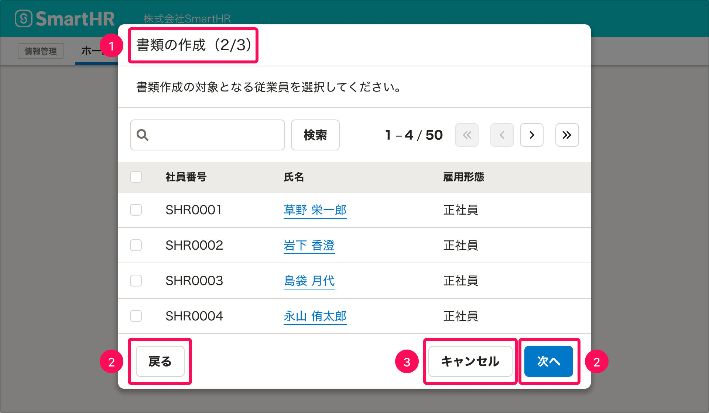

[モーダルなUI](/products/design-patterns/modal-ui/)のうち、複数のステップに分かれているものを「ウィザード」と呼びます。ここでは、ウィザードのデザインパターンを定義しています。

## 基本的な考え方

### ウィザードを乱用しない

ウィザードは、一連の操作が終わるまでユーザーの行動を制限し、またシステムがあらかじめ決めた手順での操作を強制します。ユーザー自身で手順を覚える必要がない反面、自由な手順で操作できないため、ユーザーがストレスを感じる可能性があります。

ウィザードの提供は、それが特に有効である場合に限定し、乱用を避けましょう。

### ステップの進捗を見せる

ウィザードは前後のステップの内容が見えないため、「あとどれくらいでウィザードが終わるのか」がわかりにくいのが特徴です。

わかりにくさを軽減できるよう、可能な限り「全体でいくつのステップがあるのか」「今、何番目のステップなのか」を伝えましょう。

### 典型的な使いどころ

以下のような場合、モーダルなUIを複数のステップに分けることを検討します。

- [一連の操作の中に、複雑な操作を要するものを含む場合](#h4-0)
- [条件分岐がある場合](#h4-1)
- [パタメーターの入力を伴ってワンクッション必要な操作をする場合](#h4-2)

#### 一連の操作の中に、複雑な操作を要するものを含む場合

通常のFormControlやFieldsetのほかに、「オブジェクトを検索して選択」「サンプルファイルをダウンロードして、編集してアップロード」といった複雑な操作を要するものを含む場合、その部分を1つのステップに独立させることで、ユーザーの意識を集中させることを期待できます。

#### 条件分岐がある場合

ある項目でのユーザーの操作内容によって、後続の項目の有無や内容が大きく変わる場合、ステップを分けることで、条件分岐によるUIの変化が与える違和感を軽減できます。

#### パタメーターの入力を伴って「ワンクッション必要な操作」をする場合

[ワンクッション必要な操作](/products/design-patterns/confirmation-step/)は実行前に確認のダイアログを表示しますが、この際にあわせて何らかのパラメーターの入力を伴う場合、「日付を入力するステップ」と「確認のためのステップ」で構成されたウィザードを採用することがあります。

## 種類

### モーダルダイアログによるウィザード

ウィザードは、基本的にはモーダルダイアログを使って提供します。SmartHRでは、専用のコンポーネントとして[StepFormDialog](/products/components/dialog/step-form-dialog/)を用意しています。

### ページ全体を使ったウィザード

他のモーダルなUIと同様に、表示したい情報が多い場合には、FloatAreaを使ってページ全体をウィザードにします。

## 構成

ウィザードは以下の要素で構成されています。

1. [ウィザードのタイトル](#h3-0)
2. [ステップの進捗](#h3-0)
3. [前後のステップへ移動するボタン](#h3-1)
4. [ウィザードから抜け出すボタン](#h3-2)

### 1. ウィザードのタイトル 2. ステップの進捗

ダイアログやページのタイトルエリアにウィザードのタイトルを簡潔に書き、その後にカッコ書きで `{現在のステップ}/{総ステップ数}` の形式でステップの進捗を添えます。

#### ステップごとのタイトル（任意）
それぞれのステップに固有の名前をつけることもできます。この場合、タイトルエリアにステップのタイトルを書き、ウィザードのタイトルとステップの進捗はその上に添えます。

#### Stepperによる進捗表記

文字だけでの表記に加えて、Stepperコンポーネントでステップの進捗を表現できます。すべてのステップのタイトルが常に表示されるため、ユーザーはウィザードの全体像をより正確に把握できます。

ステップ数が多いなど、ユーザーに全体像を見せておきたい場合は、Stepperの採用を検討してください。

### 3. 前後のステップへ移動するボタン

ダイアログのフッターやFloatAreaに、前後のステップへ移動するボタンを置きます。

- 左端に「前のステップへ戻るボタン」を置きます。ボタンラベルは  `戻る` とします。
- 右端に「次のステップへ進むボタン」を置きます。ボタンラベルは `次へ` とします。 Primaryボタンを使います。

ただし、ステップの進捗によって、ボタンの有無やラベルが変わります。

#### 最初のステップ
［戻る］ボタンは省略されます。

#### 途中のステップ

［戻る］・［次へ］両方のボタンが表示されます。

#### 最後のステップ

- 右端のボタンは、ウィザードを完了するものとなります。ボタンを押すと、処理が実行され、またウィザードを開始する前の画面に移動します。
- ボタンラベルは、ウィザードの目的であるタスクが完了することがわかるものにします。

### 4. ウィザードから抜け出すボタン
- すべてのステップにおいて、右からに番目の場所に、ウィザードを中断して抜け出すボタンを置きます。ボタンラベルは `キャンセル` とします。
- ボタンを押すと、ユーザーがウィザードで途中まで操作した内容は破棄され、ウィザードを開始する前の画面に移動します。