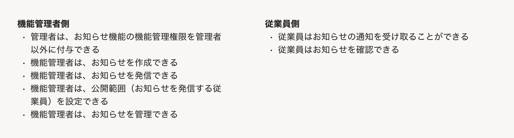
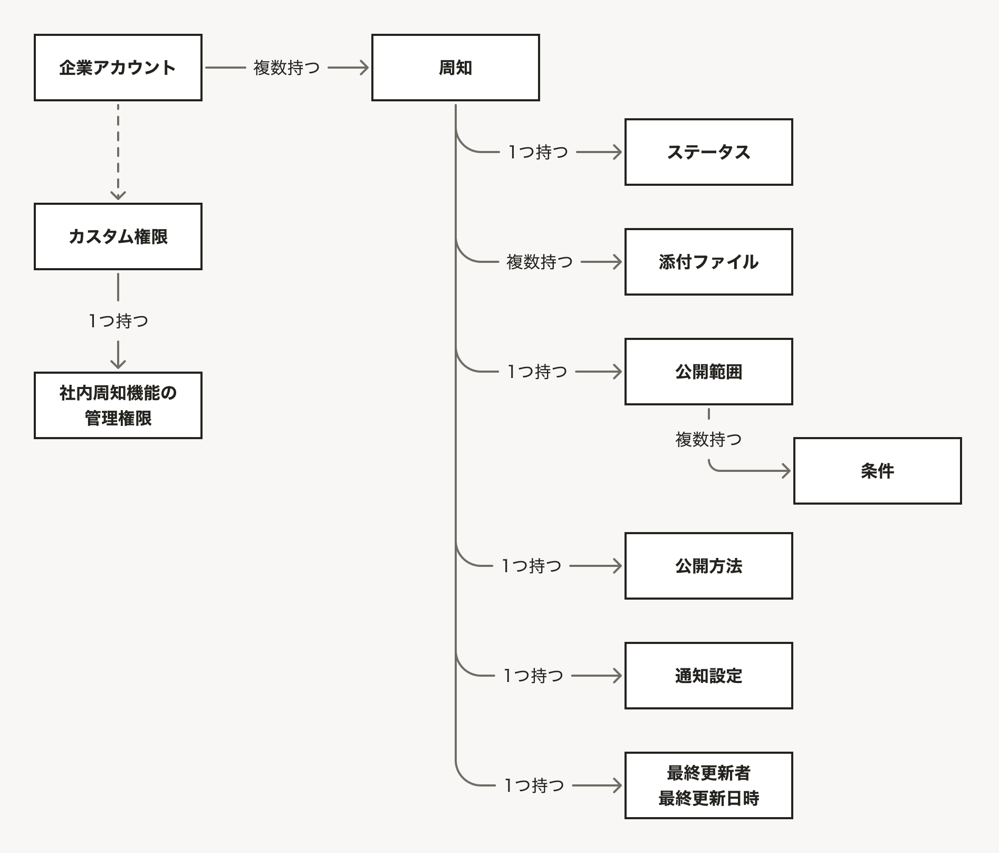
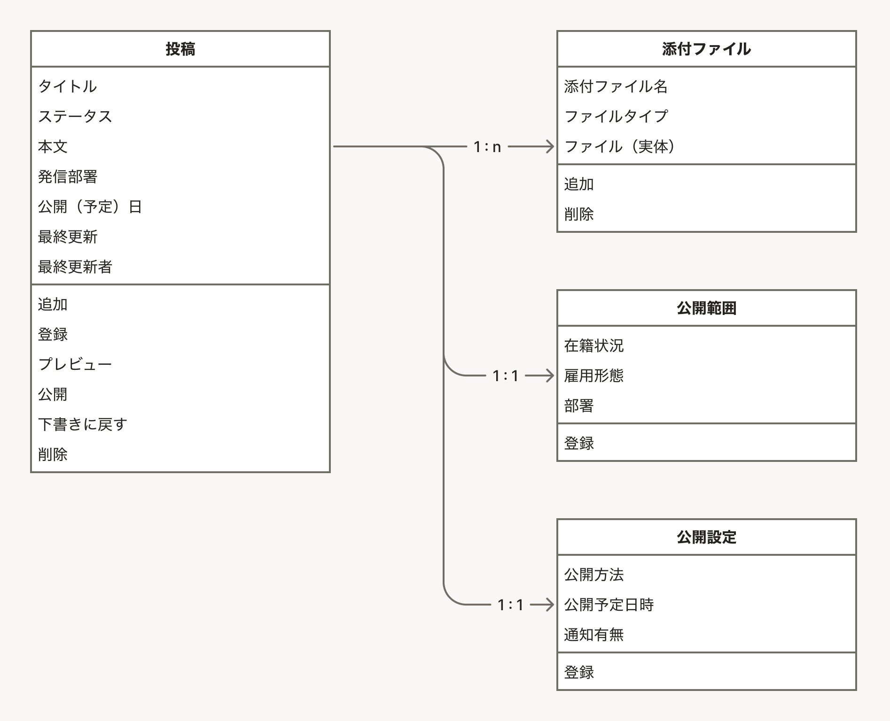
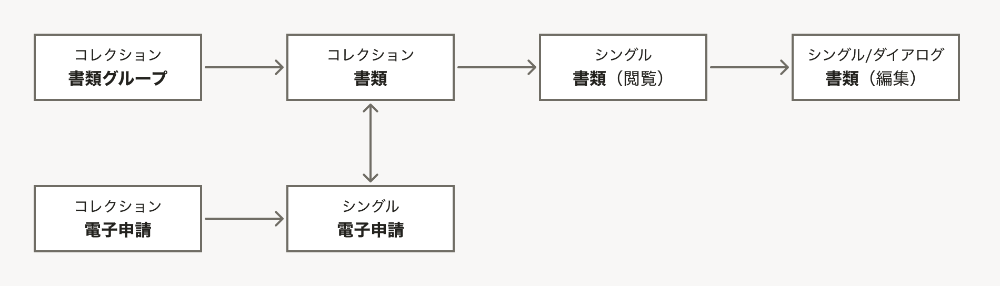

情報設計のアウトプットは、[UIデザイン使用性チェックリストの#1-#5](/products/usability/usability-checklist/#h2-2)に基づいて作成する、以下の5種類のアウトプットを指します。

1. [ユーザーの業務の説明](#h2-0)
1. [概念モデル](#h2-1)
1. [オブジェクトに付随するプロパティとアクション](#h2-2)
1. [ビューの呼び出し関係](#h2-3)
1. [メインナビゲーション](#h2-4)

これらは情報設計レビューの資料として使用します。また、情報設計レビューの実施にかかわらず、デザイナー自身の考えを整理したり、関係者間での認識を揃えたりすることに活かせます。

## 1. ユーザーの業務の説明

対象プロダクトに関する業務ドメイン全体や、それぞれのユーザーの業務フローを理解するためのアウトプットです。

プロダクトマネージャーなどが作成したPRD（プロダクト要求仕様書）に整理されている内容を転記しても構いません。また、担当デザイナーが理解を深める目的で再整理しても差し支えありません。

読み手がユーザーの業務を理解する助けとなるものであればフォーマットは明確に規定していません。レビュー対象の主題の規模によっても適切なフォーマットが異なります。

フォーマットの例として以下を参考にしてください。

- ユーザーごとのタスクを箇条書きしたもの
- ユーザーごとの業務の流れをフローチャート化したもの（業務フロー図）
- 既存の業務フローで使われている紙やExcelのキャプチャ
- プロダクトコンセプトキャンバス

### アウトプット例

## 2. 概念モデル

対象プロダクトの利用を通してユーザーが認知する、主要な概念とその関係性を可視化した図です。概念同士の親子関係や多重性（1対1、1対多など）を、矩形や線を使って図示してください。

### 注意点

- 複数のユーザーが登場し、それぞれのユーザーから見える概念が大きく異なる場合、ユーザーごとに別の図を描くこともあります。
- 段階を経て業務が完了するドメインの場合、業務プロセスの流れを示す図と混在させないよう気をつけます。流れ全体ではなく、特定の状況（例：業務が完了した）を切り取り、登場する概念と関係性を示すようにしてください。
- 概念モデルを描く段階では、UI上の表現や実装において「オブジェクトとするのか、プロパティとするのか」は、気にしなくて構いません。
- 既存の業務に登場する概念をそのままなぞることが期待されているわけではありません。コンセプトによっては、新しい概念をある種の「発明」として提案することも期待されます。

### アウトプット例

## 3. オブジェクトに付随するプロパティとアクション（オブジェクトモデル）

概念モデルに登場した概念のうち、主要なものとして取り扱うものを「オブジェクト」、付随する情報として取り扱うものを「プロパティ」として分けて整理します。あわせて、オブジェクトに対してユーザーが行なえるアクションを整理します。

オブジェクト同士の関係性（親子関係や多重性）は、概念モデルと同様に図示します。

フォーマットは、書籍『オブジェクト指向UIデザイン』（ソシオメディア・技術評論社）に掲載されている「オブジェクト・プロパティ・アクションの関係を示した図」に準拠します。

### 注意点

- UI上の表現として、ユーザーにどのように認知させるかの観点で整理します。実装の際のデータベース設計とは必ずしも一致する必要はありません。
- ER図とは異なります。

### アウトプット例

## 4. ビューの呼び出し関係

オブジェクトがどのようなビューを持ち、またビュー同士がどのような呼び出し関係で繋がるのかを可視化した図です。

フォーマットは、書籍『オブジェクト指向UIデザイン』（ソシオメディア・技術評論社）に掲載されている「ビューの呼び出し関係を示した図」に準拠します。

### 注意点

- 複数のユーザーが登場し、それぞれのユーザーに見せるオブジェクトやビューが大きく異なる場合、ユーザーごとに別の図を描きます。
- 実際のUIでは複数のビューを同じ画面内に表示する場合、当該のビューを矩形で囲むなどしてその旨を図示することがあります。
- 通常、「3. オブジェクトに付随するプロパティとアクション」で整理したオブジェクトに関するビューのみで構成されます。

### アウトプット例

## 5. メインナビゲーション

プロダクトのメインナビゲーション（SmartHRプロダクトの場合、[AppNavi](/products/components/app-navi/)に置かれることが多い）の構成を可視化したアウトプットです。ナビゲーションの項目からどのオブジェクトのどのビューに移動するのか、ナビゲーション内で階層構造を持つのかなどを図示します。

フォーマットは箇条書きや樹形図が基本です。レイアウトのキャプチャを添えても構いません。

### アウトプット例

