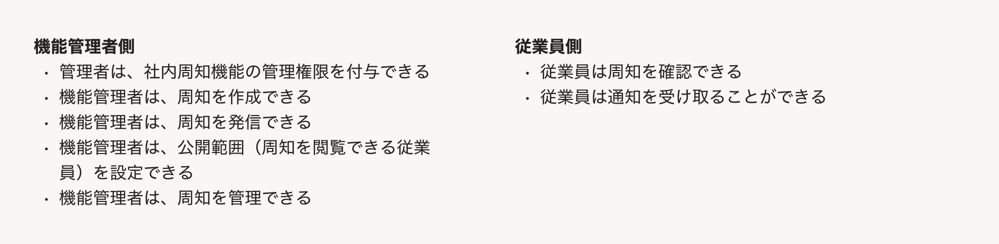

情報設計のアウトプットは、[UIデザイン使用性チェックリストの#1-#5](/products/usability/usability-checklist/#h2-2)に基づいて作成する、以下の5種類のアウトプットを指します。

1. [ユーザーの業務の説明](#h2-0)
1. [概念モデル](#h2-1)
1. [オブジェクトに付随するプロパティとアクション](#h2-2)
1. [ビューの呼び出し関係](#h2-4)
1. [メインナビゲーション](#h2-3)

## 1. ユーザーの業務の説明

- PRD（プロダクト要求仕様書）で整理したユーザーストーリーを転記することを想定
- 理解の促進を兼ねて、デザイナー自身が再整理してよい

### アウトプット例

## 2. 概念モデル

- 対象のアプリ/機能に登場する、主要な・着目すべき概念の関係を図示したもの
- ER図やオブジェクトデータモデル図 **ではない**

### アウトプット例

## 3. オブジェクトに付随するプロパティとアクション

- 「オブジェクト指向UIデザイン」（ソシオメディア・技術評論社）に掲載されている「オブジェクト・プロパティ・アクションの関係を示した図」を想定

### アウトプット例

## 4. ビューの呼び出し関係

- 「オブジェクト指向UIデザイン」（ソシオメディア・技術評論社）に掲載されている「ビューの呼び出し関係を示した図」を想定

### アウトプット例

## 5. メインナビゲーション

- [AppNavi](/products/components/app-navi/)配下のナビゲーション構成を、樹形図や箇条書きで表記したものを想定

### アウトプット例

