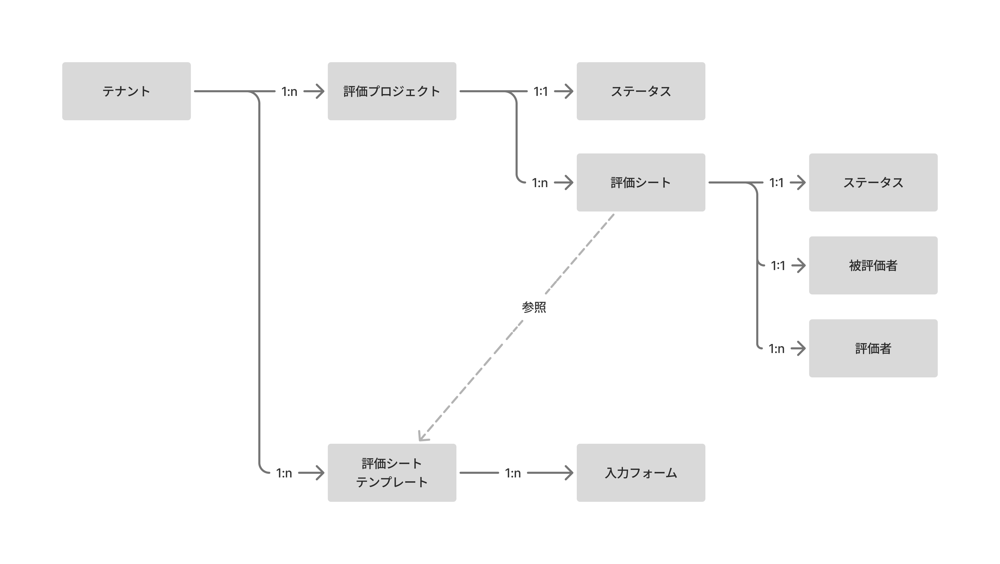
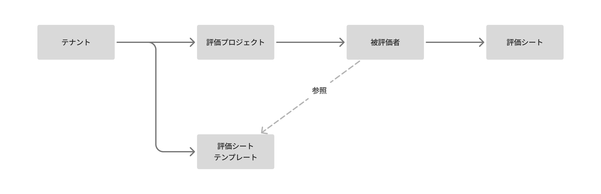
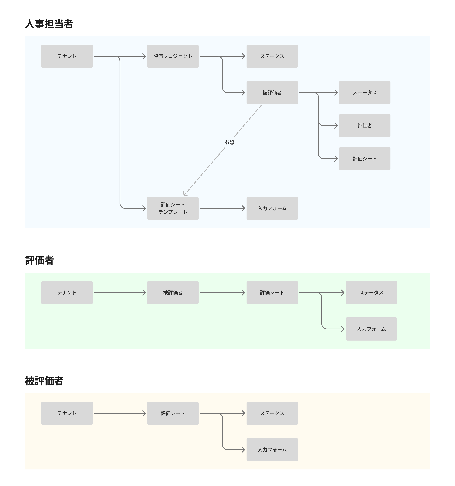
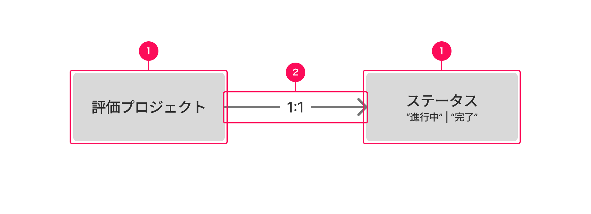

import Grid from '@/components/article/Grid.astro'
import ImgWithDesc from '@/components/article/ImgWithDesc.astro'

概念モデルは、プロダクトの利用を通してユーザーが認知する、業務上重要な概念とその関係性を可視化した図です。[UIデザイン使用性チェックリストの#2](/products/usability/usability-checklist/#h2-2)に基づく、情報設計のアウトプットの1つです。

## 目的・期待すること

概念モデルは、主に新機能開発の際に以下のことを期待して設計します。

- プロダクトをユーザーが認知する際のメンタルモデルを可視化すること
- 業務に最適な概念とその関係性を設計すること
- プロダクトがカバーする業務の範囲を可視化すること

一方で、新規機能開発の際は、既存のDBの構造や、機能への要望をそのまま描き起こすことは期待されません。業務の目的の達成に必要であれば、既存の業務にはない新たな概念を提案することもあります。

既存機能や既存業務のメンタルモデルを可視化するためにも使えます。

概念が複雑な場合は、特に重要な概念のみを記載した簡易版を書いたり、登場人物ごとに扱う概念が大きく異なる場合は、登場人物ごとに概念モデルを書くこともできます。

<Grid>
  <ImgWithDesc description="簡易版の概念モデル">
  
  </ImgWithDesc>
  <ImgWithDesc description="登場人物ごとの概念モデル">
  
  </ImgWithDesc>
</Grid>

## 他の図との違い

### オブジェクトモデルとの違い

概念モデルは、[オブジェクトモデル](/products/information-architecture/object-model/)のようにオブジェクトとその関係性を示し、それらのプロパティやアクションを洗い出すものではありません。

オブジェクトに限らない、業務上重要な概念（プロパティ・プロセス・ナビゲーションなどを含む）とその関係性を示します。

{/* textlint-disable */}
### 業務フロー・操作フロー・画面遷移図・ビューの呼び出し関係との違い

概念モデルは、業務フロー・操作フロー・画面遷移図・[ビューの呼び出し関係](/products/information-architecture/view-relationship-diagram/)のようにユーザーが経験するプロセスを示す図ではありません。
{/* textlint-enable */}
それらのプロセスの中に登場する概念とその関係性を抽象化して整理します。概念を扱う流れや実際の画面は図に現れません。

## 構成

### 1. 概念

プロダクトに登場する業務上重要な概念を矩形で示します。

業務上重要な概念とは、プロダクトや業務を説明するうえで不可欠な概念です。それらに付随し、主たる業務のなかで強く意識されないものは記載しません。

- 一般的に概念モデルに記載する概念の例
  - 従業員、部署、評価、投稿、ステータス
- 一般的に概念モデルに記載しない概念の例
  - 説明文、表示順、作成日時、作成者

#### 書き方

- 矩形には概念の名前を記載します。あわせて、概念が取りうる値や名前を併記できます。
- 概念の親子関係に従い、左から右に書き連ねます。同じ階層の概念は縦方向に書き連ねます。

### 2. 関係性を示す矢印

概念同士が関係し合っていることを矢印で示します。主に親子関係と参照関係を示します。

参照関係とは、単体では成立せず、別の概念の存在を前提としてはじめて意味を持つ概念とその元となる概念との関係をいいます。

矢印には、多重度を記載します。多重度とは、ある概念が、別の概念といくつ結びつくかを表す数字です。

#### 書き方

- 親子関係を示す矢印は実線に、参照関係を示す矢印は点線にします。
- 多重度は、1:1, 1:0..1, 1:0..n, 1:1..n, 1:nというように`{結びつきの数}`:`{結びつきの数}`の形式で記載します。 
    - nは任意の複数を表します。
    - 0..1のように2つの数を..で繋げて表記することで、「0または1を取る」というように値の範囲を表せます。
- 矢印の方向は、親→子、参照→被参照とします。

## 作成手順

SmartHRのプロダクトを例にした概念モデルの作成手順は、下記の社内ドキュメントを参照してください。

https://app.notion.com/p/38a37b6398eb80b5acaeffc47194e0c4?source=copy_link#38a37b6398eb8090bffef5273b49c046

## 妥当性を判断する観点

### 全般

| 観点 | 詳細 | 対処法 |
| :--- | :--- | :--- |
| 既存のDBの構造や、機能への要望をそのまま描き起こしていないか | ユーザーの視点で業務に最適な概念とその関係性を設計することが、新機能開発の際の概念モデルの目的です。| 業務に必要な概念とその関係性を設計してください。必要に応じて、既存の業務にはない新たな概念を提案することも検討してください。 |
| 近接業務を扱うSmartHR上の他プロダクトの概念構造に矛盾していないか | SmartHRのプロダクトの中には、業務上の繋がりがあり、ユーザーが連続して利用するものがあります。それらのプロダクトで、業務の捉え方（概念とその関係性の設計）が異なるとユーザーのプロダクトを横断したスムーズな利用を妨げます。| 既存プロダクトと一貫性のある概念を設計してください。|

### 概念

| 観点 | 詳細 | 対処法 |
| :--- | :--- | :--- |
| 概念の命名が業務に即したわかりやすいものになっているか | 業務に登場しない命名が多く登場する場合、業務理解が不足していたり、概念の抽象化が上手くいっていない可能性があります。 | 業務理解を深め、業務に合った粒度の概念を設計し、業務に登場する言葉に基づいた名前を検討してください。 |
| 概念をグルーピングする概念が、業務に即したものになっているか | 業務で情報を扱う際の単位とプロダクト上のグルーピングの単位が揃っていることを確認してください。業務に即していない概念を作ろうとしている場合、命名も過度に汎用になっている可能性があります。 例：「〇〇情報」「〇〇グループ」「〇〇セット」| 業務理解を深め、業務に合った粒度の概念を設計し、業務に登場する言葉に基づいた名前を検討してください。|
| 「〇〇の▢▢」といった概念が登場していないか | 概念の分割が不十分な可能性があります。| 〇〇と▢▢に概念を分割することで、概念モデルがよりシンプルにならないか確認してください。|
| 動作を表す言葉が概念として登場していないか | 概念は原則として名詞です。「〇〇する」という動詞の「〇〇」の部分を概念名としている場合、概念ではない、操作や処理を概念として扱っている可能性があります。| 動作を表す言葉が示す操作や処理の対象を概念として扱うことを検討してください。 例：「依頼」ではなく、依頼の提出物である「書類」や依頼先である「従業員」を概念として扱う。|
| 概念の名前が動作を表す言葉を含む場合、その主体や目的が明確か | 動作の主体や目的が不明確である場合、ユーザーは概念の役割や意味を理解できない可能性があります。 不適切な例：反映項目、共有者 | 動作の主体や目的を明確にしてください。 適切な例：反映の対象項目、共有先 |
| 名前の末尾に同じ言葉を持つ概念が複数ないか | 名前の末尾に同じ言葉を持つ概念が複数ある場合、種類や形態が異なるが同一のものである概念を、それぞれ別の概念としている可能性があります。 例：「入力タスク」と「確認タスク」 | 末尾に同じ言葉を持つ概念同士を抽象化して、1つの概念として取り扱えないか検討してください。 例：「入力タスク」と「確認タスク」を1つの概念「タスク」にまとめ、入力か確認かはタスクの種類として扱う。|

### 関係性・構造

| 観点 | 詳細 | 対処法 |
| :--- | :--- | :--- |
| 階層が深くなりすぎていないか | 難解で理解が難しい構造になっている可能性があります。 | 概念を統合したり、分離したりして階層を減らし、よりシンプルな構造にできないか検討してください。 |
| プロダクトが対象とする業務の規模に対して、概念が多すぎないか | プロダクトが対象とする規模が大きい場合には、概念もそれに応じて多くなりますが、概念が多くなればなるほど難解で理解が難しい構造になっていきます。 | 概念を統合したりしてできるだけ構造をシンプルにしてください。また、概念が多い場合は[簡易版の概念モデル](#h2-0)を用意することで、全体像が把握しやすくなります。|
| 複雑な親子関係・参照関係が発生していないか | 大量の矢印が発生していたり、矢印が右から左へ逆行している場合、難解で理解が難しい構造になっている可能性があります。| 概念の親子関係が適切か、概念の統合・分離ができないか検討してください。|
| 1:1の関係性が連続していないか | 1:1の関係性が連続する場合、中間の概念は不要である可能性があります。 | 中間の概念を省いて概念モデルが成り立たないか検討してください。|
| 親子関係にある概念を「`{親}`の`{子}`」と呼んで意味が成立するか | 意味が成立しない場合、ユーザーにとってわかりやすい親子関係ではない可能性があります。 | 親子関係を見直したり、命名を見直してください。|