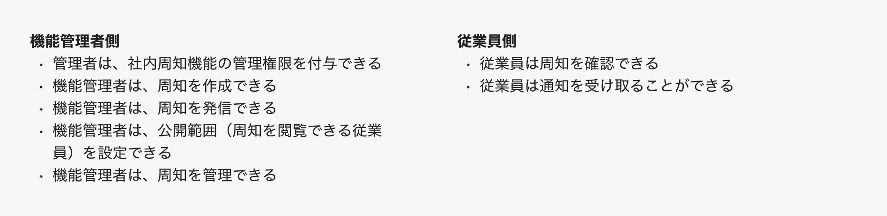
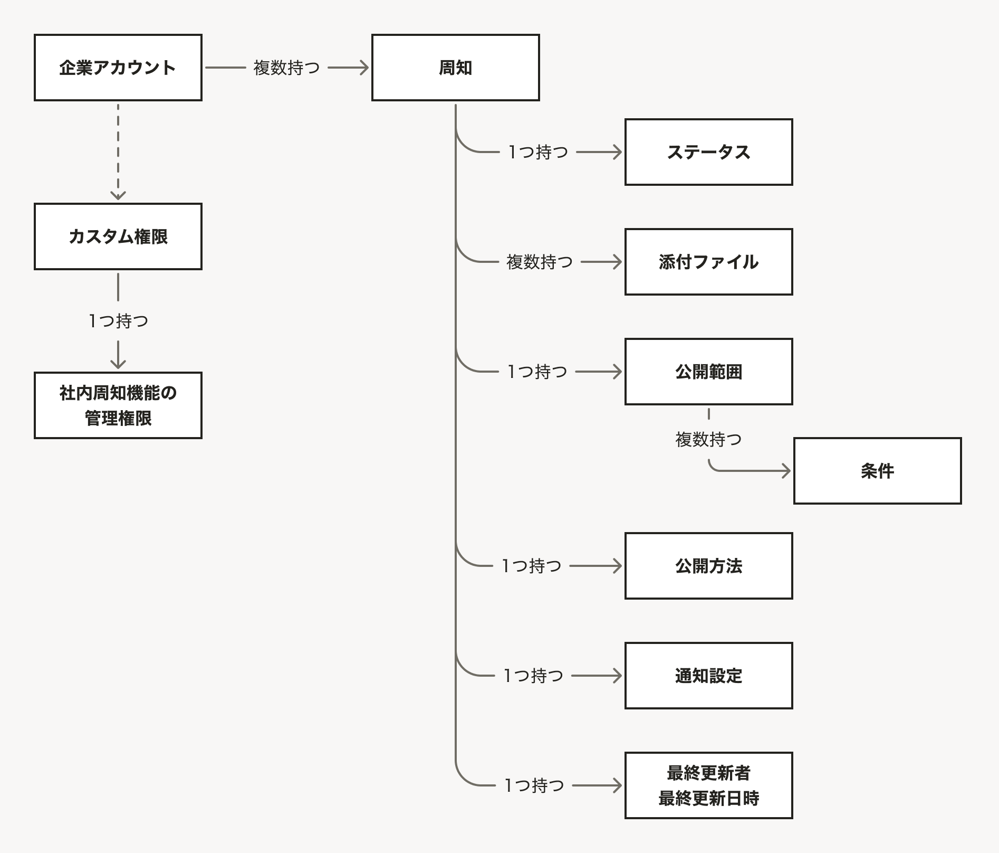
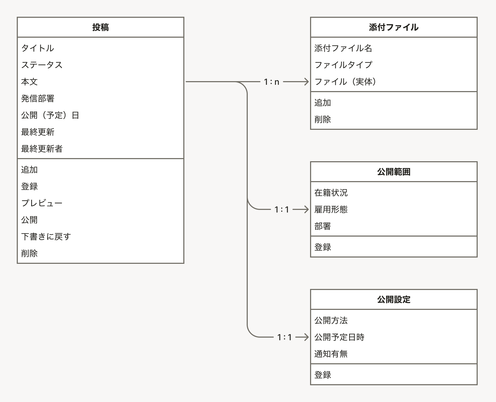

情報設計のアウトプットは、[UIデザイン使用性チェックリストの#1-#5](/products/usability/usability-checklist/#h2-2)に基づいて作成する、以下の5種類のアウトプットを指します。

1. [ユーザーの業務の説明](#h2-0)
1. [概念モデル](#h2-1)
1. [オブジェクトに付随するプロパティとアクション（オブジェクトモデル）](#h2-2)
1. [ビューの呼び出し関係](#h2-3)
1. [メインナビゲーション](#h2-4)

これらは情報設計レビューの資料として使用します。また、情報設計レビューの実施にかかわらず、デザイナー自身の考えを整理したり、関係者間での認識を揃えたりすることに活かせます。

## 1. ユーザーの業務の説明

対象プロダクトに関する業務ドメイン全体や、それぞれのユーザーの業務フローを理解するためのアウトプットです。

### 目的・期待すること

ユーザーの業務の説明は、以下のことを期待して用意します。

- ユーザーの業務の流れを理解すること
- ユーザーの業務の主な関心を理解すること
- プロダクトの登場人物を特定すること
- プロダクトの主要なユースケースを特定すること
- その他の情報設計のアウトプットやUIの妥当性を判断するための根拠となること

### SmartHRでの使い方

プロダクトマネージャーなどが作成したPRD（プロダクト要求仕様書）に整理されている内容を転記しても構いません。また、担当デザイナーが理解を深める目的で再整理しても差し支えありません。

読み手がユーザーの業務を理解する助けとなるものであればフォーマットは明確に規定していません。レビュー対象の主題の規模によっても適切なフォーマットが異なります。

フォーマットの例として以下を参考にしてください。

- ユーザーごとのタスクを箇条書きしたもの
- ユーザーごとの業務の流れをフローチャート化したもの（業務フロー図）
- 既存の業務フローで使われている紙やExcelのキャプチャ
- プロダクトコンセプトキャンバス
  - 詳細は以下の社内ドキュメントを参照：[プロダクトコンセプトキャンバスの手引](https://www.notion.so/28e37b6398eb80dd8e52f332293ea467?source=copy_link)

## 2. 概念モデル

対象プロダクトの利用を通してユーザーが認知する、業務上重要な概念とその関係性を可視化した図です。

### 目的・期待すること

概念モデルは、主に新機能開発の際に以下のことを期待して設計します。

- プロダクトをユーザーが認知する際のメンタルモデルを可視化すること
- 業務に最適な概念とその関係性を設計すること
- プロダクトがカバーする業務の範囲を可視化すること

また、新機能だけでなく、既存機能や既存業務のメンタルモデルを可視化するためにも使えます。

### 他の図との違い

#### オブジェクトモデルとの違い

概念モデルは、[オブジェクトモデル](#h2-2)のようにオブジェクトとその関係性を示し、それらのプロパティやアクションを洗い出すものではありません。

オブジェクトに限らない、業務上重要な概念（プロパティ・プロセス・ナビゲーションなどを含む）とその関係性を示します。

#### 業務フロー・操作フロー・画面移動図・ビューの呼び出し関係との違い

概念モデルは、業務フロー・操作フロー・画面移動図・[ビューの呼び出し関係](#h2-3)のようにユーザーが経験するプロセスを示す図ではありません。

それらのプロセスの中に登場する概念とその関係性を抽象化して整理します。概念を扱う流れや実際の画面は図に現れません。

### SmartHRでの使い方

概念モデルのSmartHRでの使い方について詳しくは、下記の社内ドキュメントを参照してください。

https://app.notion.com/p/WIP_-33037b6398eb80548dcac18e4c28245e?source=copy_link#33037b6398eb809ca422ccc5009cd318

## 3. オブジェクトモデル

ユーザーが対象プロダクトを利用するうえで主要な関心の対象となる「オブジェクト」とその関係性を可視化した図です。

フォーマットは、書籍『オブジェクト指向UIデザイン』（ソシオメディア・技術評論社）に掲載されている「オブジェクト・プロパティ・アクションの関係を示した図」に準拠します。

### 目的・期待すること

オブジェクトモデルは、主に新機能開発の際に以下のことを期待して設計します。

- ユーザーがプロダクトを認知する際のメンタルモデルを可視化すること
- オブジェクトとその関係性をできるだけシンプルにすること
- オブジェクトに付随するプロパティとアクションを精査すること
- オブジェクト指向なUIを設計すること

また、新機能だけでなく、既存機能や既存業務のメンタルモデルを可視化するためにも使えます。

メンタルモデルの全体像の可視化は概念モデルでも達成できますが、オブジェクトモデルではより実際の画面や物理設計を導くために詳細な構造を可視化します。

### 他の図との違い

#### 概念モデルとの違い

オブジェクトモデルは、[概念モデル](#h2-1)のように、プロパティ・プロセス・ナビゲーションなどを含んで概念を整理する図ではありません。

ユーザーの主要な関心の対象であるオブジェクト（および、それに付随するプロパティとアクション）を図にします。

#### データモデルとの違い

オブジェクトモデルは、ER図といったデータモデルのようにデータベース設計を直接の目的とする図ではありません。

ユーザーがプロダクトをどう認知するかを図にしたものであり、その構造は必ずしもデータモデルと一致しません。

また、プロパティだけでなく、UI上でユーザーが操作するアクションも記載する点も異なります。「返信」「承認」「アーカイブ」のような、いわゆるデータベースのCRUD操作とは粒度が異なるアクションも図に示します。

### SmartHRでの使い方

オブジェクトモデルのSmartHRでの使い方について詳しくは、下記の社内ドキュメントを参照してください。

https://app.notion.com/p/WIP_-33037b6398eb80548dcac18e4c28245e?source=copy_link#33037b6398eb809ca422ccc5009cd318

## 4. ビューの呼び出し関係

オブジェクトがどのようなビューを持ち、またビュー同士がどのような呼び出し関係で繋がるのかを可視化した図です。

フォーマットは、書籍『オブジェクト指向UIデザイン』（ソシオメディア・技術評論社）に掲載されている「ビューの呼び出し関係を示した図」に準拠します。

### 目的・期待すること

### 他の図との違い

### SmartHRでの使い方

## 5. メインナビゲーション

プロダクトのメインナビゲーション（SmartHRプロダクトの場合、[AppNavi](/products/components/app-navi/)に置かれることが多い）の構成を可視化したアウトプットです。ナビゲーションの項目からどのオブジェクトのどのビューに移動するのか、ナビゲーション内で階層構造を持つのかなどを図示します。

### 目的・期待すること

### 他の図との違い

### SmartHRでの使い方

