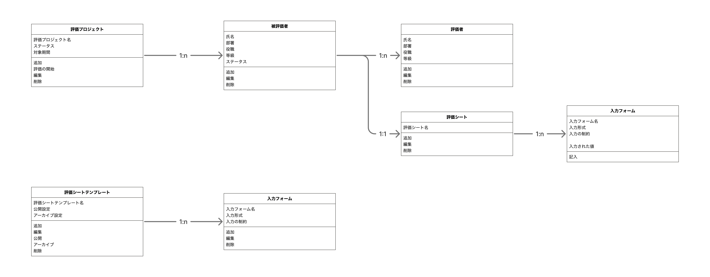
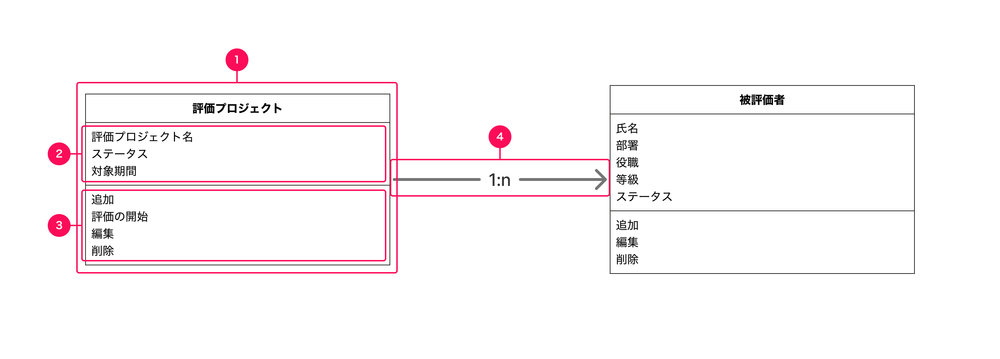

import { BaseColumn } from 'smarthr-ui'
import { ObjectModelNote } from './_components/ObjectModelNote'
import NumberedTable from '../_components/NumberedTable.astro'

オブジェクトモデルは、ユーザーがプロダクトを利用するうえで主要な関心の対象となる「オブジェクト」とその関係性を可視化した図です。[UIデザイン使用性チェックリストの#3](/products/usability/usability-checklist/#h2-2)に基づく、情報設計のアウトプットの1つです。

<BaseColumn className='shr-mt-2'>
  <ObjectModelNote />
</BaseColumn>

## 目的・期待すること

オブジェクトモデルは、主に新機能開発の際に以下のことを期待して設計します。

- ユーザーがプロダクトを認知する際のメンタルモデルを可視化すること
- オブジェクトとその関係性をできるだけシンプルにすること
- オブジェクトに付随するプロパティとアクションを精査すること
- オブジェクト指向なUIを設計すること

また、新機能だけでなく、既存機能や既存業務のメンタルモデルを可視化するためにも使えます。

メンタルモデルの全体像の可視化は[概念モデル](/products/information-architecture/ia-outputs/conceptual-model/)でも達成できますが、オブジェクトモデルではより実際の画面や物理設計を導くために詳細な構造を可視化します。

## 他の図との違い

### 概念モデルとの違い

オブジェクトモデルは、[概念モデル](/products/information-architecture/ia-outputs/conceptual-model/)のように、プロパティ・プロセス・ナビゲーションなどを含んで概念を整理する図ではありません。

ユーザーの主要な関心の対象であるオブジェクト（および、それに付随するプロパティとアクション）を図にします。

### データモデルとの違い

オブジェクトモデルは、ER図といったデータモデルのようにデータベース設計を直接の目的とする図ではありません。

ユーザーがプロダクトをどう認知するかを図にしたものであり、その構造は必ずしもデータモデルと一致しません。

また、プロパティだけでなく、UI上でユーザーが操作するアクションを記載する点も異なります。「返信」「承認」「アーカイブ」のような、いわゆるデータベースのCRUD操作とは粒度が異なるアクションも図に示します。

## 構成

### 1. オブジェクト

ユーザーが機能を利用するうえで主要な関心の対象となる概念を矩形で示します。

#### 書き方

- 矩形の上部にオブジェクト名を記載します。
- 概念の親子関係に従い、左から右に書き連ねます。同じ階層の概念は縦方向に書き連ねます。

### 2. プロパティ

オブジェクトに付随する情報を記載します。

#### 書き方

- オブジェクトの矩形の中に列挙します

### 3. アクション

オブジェクトに対してユーザーが実行できる操作を記載します。ただし、閲覧や確認といったオブジェクトをユーザーが見る行為は操作として扱いません。

#### 書き方

- オブジェクトの矩形の中に列挙します

### 4. 関係性を示す矢印

オブジェクト同士が関係し合っていることを矢印で示します。主に親子関係と参照関係を示します。[概念モデルの関係性を示す矢印](/products/information-architecture/ia-outputs/conceptual-model/#h3-3)と基本的に同様です。

#### 書き方

- 親子関係を示す矢印は実線に、参照関係を示す矢印は点線にします。
- 多重度は、「1:1」「1:0..1」「1:0..n」「1:1..n」「1:n」というように`{結びつきの数}`:`{結びつきの数}`の形式で記載します。 
    - 「n」は任意の複数を表します。
    - 「0..1」のように2つの数を..で繋げて表記することで、「0または1を取る」というように値の範囲を表せます。
- 矢印の方向は、親→子、参照→被参照とします。

## 作成手順

SmartHRのプロダクトを例にしたオブジェクトモデルの作成手順は、下記の社内ドキュメントを参照してください。

https://app.notion.com/p/38a37b6398eb80b5acaeffc47194e0c4?source=copy_link#38a37b6398eb8048ab0ee57da7692675

## 妥当性を判断する観点

基本的に、概念モデルの妥当性を判断する観点をそのままオブジェクトモデルにもあてはめることができます。[概念モデルの妥当性を判断する観点](/products/information-architecture/ia-outputs/conceptual-model/#h2-4)も併せて参照してください。

### オブジェクト

<NumberedTable>

| # | 観点 | 詳細 | 対処法 |
| :---: | :--- | :--- | :--- |
| 1 | オブジェクトが複数のプロパティやアクションを持っているか | 多くの場合、オブジェクトは複数のプロパティと複数のアクションを持ちます。プロパティやアクションを持たない場合や、単一のプロパティやアクションのみを持つ場合、それは独立したオブジェクトではなく他のオブジェクトのプロパティである可能性があります。 | 他のオブジェクトのプロパティとして整理できないか検討してください。 |
| 2 | 画面上のレイアウトを示す言葉がオブジェクト名になっていないか | 「図」「表」「一覧」といった画面上のレイアウト（ビュー）を示す言葉がオブジェクトに登場する場合、それらのビューが実際に示すオブジェクトが見落とされている可能性が高く、注意が必要です。 | ビューで実際に扱う情報をオブジェクトとして整理できないか検討してください。 |
| 3 | 文字列や数値や日付をオブジェクトとしていないか | 「推薦文」「期間」「年度」といった文字列や数値や日付はプロパティとして扱います。 | 他のオブジェクトのプロパティとして扱えないか検討してください。 |
| 4 | 想定されるインスタンス名が業務で扱う言葉として理解しやすいか | ユーザーが実際にオブジェクトのインスタンスに対して名づけると想定される名前が、業務に登場する言葉で構成されているか確認してください。業務上馴染みがなく、理解が難しいインスタンス名になる場合、より良いオブジェクトの命名や構造がある可能性があります。 | オブジェクトの粒度や命名を見直し、インスタンス名を想起しやすいオブジェクトにしてください。 |

</NumberedTable>

### 関係性・構造

<NumberedTable>

| # | 観点 | 詳細 | 対処法 |
| :---: | :--- | :--- | :--- |
| 5 | 概念モデルに矛盾した構造になっていないか | オブジェクトモデルと概念モデルの図としての表現に差はありますが、それぞれが示すプロダクトの構造は共通しています。概念モデルに登場する概念が登場しなかったり、概念モデルの概念の関係性とオブジェクトモデルのオブジェクトの関係性が異なっていたり、構造の矛盾がないか確認してください。 | 概念モデルとオブジェクトモデルが示す構造が一致するようそれぞれの図を見直してください。 |

</NumberedTable>

### アクション

<NumberedTable>

| # | 観点 | 詳細 | 対処法 |
| :---: | :--- | :--- | :--- |
| 6 | アクションの主体がユーザーになっているか | オブジェクトに対するアクションの主体はユーザーです。システムが主体の行為をアクションとして挙げていないか確認してください。 | システムの処理はオブジェクトモデルに記載しないでください。 |
| 7 | アクションに不足はないか | オブジェクトの操作を通して、業務が完遂できるか確認してください。特に、業務において強く意識されない基本的なアクション（例：作成、編集、複製、削除）が不足していないか確認してください。 | 業務の完遂に必要なアクションを追記してください。 |

</NumberedTable>

### プロパティ

<NumberedTable>

| # | 観点 | 詳細 | 対処法 |
| :---: | :--- | :--- | :--- |
| 8 | プロパティ名が「○○の□□」になっていないか | プロパティ名が「○○の□□」というように複数の言葉で構成されている場合、○○に該当する情報はオブジェクトである可能性があります。 | ○○に該当する情報をオブジェクトとして整理できないか検討してください。 |
| 9 | プロパティに不足はないか | オブジェクトやビューの操作に必要な情報が不足していないか確認してください。| 業務の完遂に必要なプロパティを追記してください。 |

</NumberedTable>