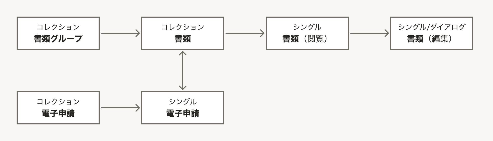

import { BaseColumn } from 'smarthr-ui'
import { ViewRelationshipDiagramNote } from './_components/ViewRelationshipDiagramNote'

ビューの呼び出し関係は、オブジェクトがどのようなビューを持ち、またビュー同士がどのような呼び出し関係で繋がるのかを可視化した図です。[UIデザイン使用性チェックリストの#4](/products/usability/usability-checklist/#h2-2)に基づく、情報設計のアウトプットの1つです。

<BaseColumn className='shr-mt-2'>
  <ViewRelationshipDiagramNote />
</BaseColumn>

## 注意点

- 複数のユーザーが登場し、それぞれのユーザーに見せるオブジェクトやビューが大きく異なる場合、ユーザーごとに別の図を描きます。
- 実際のUIで複数のビューを1つの画面内に表示する場合は、該当のビューを矩形で囲むなどしてその旨を図示することがあります。
- 通常、[オブジェクトモデル](/products/information-architecture/ia-outputs/object-model/)で整理したオブジェクトに関するビューのみで構成されます。