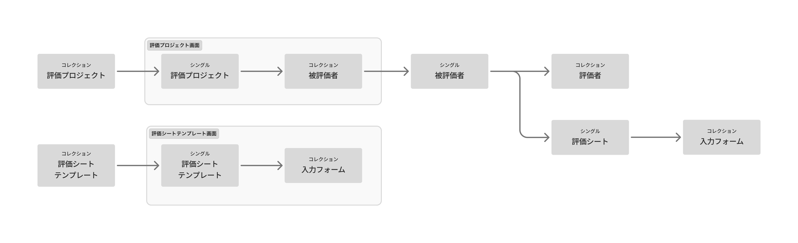
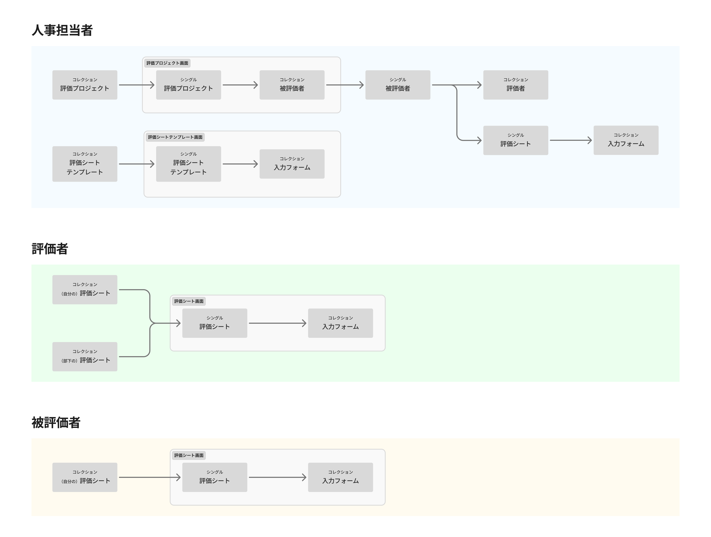
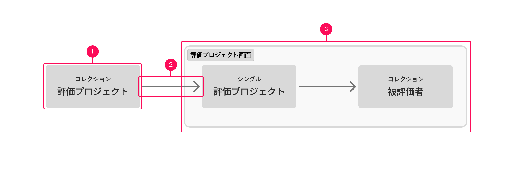

import { BaseColumn } from 'smarthr-ui'
import NumberedTable from '../_components/NumberedTable.astro'
import { ViewRelationshipDiagramNote } from './_components/ViewRelationshipDiagramNote'

ビューの呼び出し関係は、オブジェクトがどのようなビューとして表れ、またビュー同士がどのような呼び出し関係で繋がるのかを可視化した図です。[UIデザイン使用性チェックリストの#4](/products/usability/usability-checklist/#h2-2)に基づく、情報設計のアウトプットの1つです。

<BaseColumn className='shr-mt-2'>
  <ViewRelationshipDiagramNote />
</BaseColumn>

## 目的・期待すること

ビューの呼び出し関係は、主に新機能開発の際に以下のことを期待して設計します。

{/* textlint-disable */}

- [オブジェクトモデル](/products/information-architecture/ia-outputs/object-model/)で整理したオブジェクトが、実際にどのようなビューとして現れるのか設計・可視化すること
- 業務に最適な画面遷移の構造を設計すること
- プロダクト全体の画面の構成を可視化すること
- ビューの呼び出し関係を元に作られるUIがオブジェクト指向になること

{/* textlint-enable */}

また、プロダクトの現在地を整理する目的で、既存機能の画面の構成の可視化やオブジェクトの洗い出しにも使えます。

## ビューの呼び出し関係のバリエーション

登場人物ごとに扱うオブジェクトやビューが大きく異なる場合は、登場人物ごとにビューの呼び出し関係を描くことができます。

## 他の図との違い

### 概念モデル・オブジェクトモデルとの違い

ビューの呼び出し関係は、[概念モデル](/products/information-architecture/ia-outputs/conceptual-model/)や[オブジェクトモデル](/products/information-architecture/ia-outputs/object-model/)のように画面を横断して現れる抽象的な概念の構造を示す図ではありません。

それらの図で検討されたオブジェクトが、実際のUIでどう表現されるかをビューの構成から示します。

{/* textlint-disable */}
### 画面遷移図との違い

ビューの呼び出し関係は、画面遷移図のようにページの切り替わりの単位で繋がりを示す図ではありません。
{/* textlint-enable */}

コレクションやシングルといったビュー同士がどのように繋がるのかを示します。それらは必ずしも単一のページとして現れず、ページ内に複数のビューが含まれることもあります。また、画面名ではなくオブジェクトの名前の記載を基本とし、コレクションやシングルといったビューの性質を併記することで、オブジェクト指向なUIを設計することも目的としています。

### メインナビゲーションとの違い

ビューの呼び出し関係は、[メインナビゲーション](/products/information-architecture/ia-outputs/main-navigation/)のようにプロダクトの最上位のナビゲーションの構成を示す図ではありません。

階層に関わらず、すべてのビューとその呼び出し関係を示します。

## 構成

### 1. ビュー

オブジェクトの一覧や詳細といった、画面上にオブジェクトが現れる際の表示単位をビューとして矩形で示します。基本的に、オブジェクトの一覧を示す「コレクション」と、1つのオブジェクトの詳細を示す「シングル」の2種類に分類します。

#### 書き方

- 矩形の上部にビューの分類（コレクション/シングル）を、下部に対象となるオブジェクトの名前を記載します。
- 呼び出す順に従い、左から右に書き連ねます。

### 2. 呼び出し関係を示す矢印

あるビューから、別のビューがどのように呼び出されるのか、また、あるビューから、別のビューへどのように移動できるのかを矢印で示します。

#### 書き方

- 実線の矢印で示します。
- 相互に行き来する場合は、双方向の矢印にします。

### 3. グルーピング

複数のビューが1つの画面内に表示される場合に、同一画面に属することをグルーピングで示します。

#### 書き方

{/* textlint-disable */}

- 対象のビューをまとめて矩形で囲みます。
- 画面名がある場合は、矩形に付記することもできます。

{/* textlint-enable */}

## 作成手順

SmartHRのプロダクトを例にしたビューの呼び出し関係の作成手順は、下記の社内ドキュメントを参照してください。

https://app.notion.com/p/38a37b6398eb80b5acaeffc47194e0c4?source=copy_link#38a37b6398eb80b98d2ac7684c91366c

## 妥当性を判断する観点

ビューの呼び出し関係に改善点や課題が見つかった場合、[オブジェクトモデル](/products/information-architecture/ia-outputs/object-model/)にも改善点や課題がある可能性があります。オブジェクトモデルに立ち戻ることも検討してください。

### 全般

{/* textlint-disable */}

<NumberedTable>

| # | 観点 | 詳細 | 対処法 |
| :---: | :--- | :--- | :--- |
| 1 | ビューの呼び出し関係がUIの構成と一致しているか | ビューの呼び出し関係は、実際のUIでのオブジェクトの扱いを示すため、UIの構造と一致します。UIに存在するオブジェクトの表示や遷移が表現されていない場合、業務に最適な呼び出し関係となっているかやオブジェクト指向になっているかが判断できません。（ビューの呼び出し関係がUIに反映されていない場合も同様） | ビューの呼び出し関係に登場するビューおよびその呼び出し関係と、UIに登場するそれらを一致させてください。 |

</NumberedTable>

{/* textlint-enable */}

### ビュー

<NumberedTable>

| # | 観点 | 詳細 | 対処法 |
| :---: | :--- | :--- | :--- |
| 2 | オブジェクトモデルに登場するすべてのオブジェクトがビューとして登場しているか | ビューの呼び出し関係は、実際のUIでのオブジェクトの扱いを示すため、基本的にすべてのオブジェクトが登場します。ビューの呼び出し関係に登場しないオブジェクトがある場合、必要なビューが見落とされているか、オブジェクトではないものをオブジェクトとして扱っている可能性があります。 | オブジェクトに対応するビューを追加してください。オブジェクトに対応するビューが不要に思える場合は、[オブジェクトモデル](/products/information-architecture/ia-outputs/object-model/)に立ち戻り、それがオブジェクトとして扱うべき情報か再検討してください。 |
| 3 | 1つのオブジェクトに対して、コレクションとシングルの両方が登場しているか | 基本的に、オブジェクト1つに対して、コレクションとシングルの2つのビューが必要です。例外的に、コレクションだけですべての操作が完結する場合はシングルを省略することもできますが、コレクションを省略することはできません。 | コレクションとシングルの両方のビューを追加してください。（前述のとおり、例外的にコレクションだけですべての操作が完結する場合はシングルを省略することもできます。） |

</NumberedTable>

### 呼び出し関係

<NumberedTable>

| # | 観点 | 詳細 | 対処法 |
| :---: | :--- | :--- | :--- |
| 4 | コレクションがコレクションを呼び出していないか | コレクションはオブジェクトの集合であるため、コレクションが呼び出す対象はシングルです。コレクションがコレクションを呼び出す関係となっている場合、必要なオブジェクトやシングルビューが見落とされているか、オブジェクト以外の一覧表現（機能のナビゲーションや、情報のグルーピング）をコレクションとしている可能性があります。 | 見落としているビューがないか、オブジェクト以外の一覧をビューとして扱っていないか、見落としているオブジェクトがないか確認し、コレクションがコレクションを呼び出す関係を解消してください。 |
| 5 | オブジェクト同士の関係性に矛盾していないか | [オブジェクトモデル](/products/information-architecture/ia-outputs/object-model/)でのオブジェクトの親子関係は、基本的にビューの呼び出し関係としても同じように現れます。親子関係が逆転していたり、呼び出し関係がない場合、オブジェクト同士の関係性の理解を妨げます。 | オブジェクトモデルでの親子関係を反映してください。そのままで不都合がある場合は、[オブジェクトモデル](/products/information-architecture/ia-outputs/object-model/)に立ち戻り、オブジェクト同士の関係性を再検討してください。 |

</NumberedTable>
