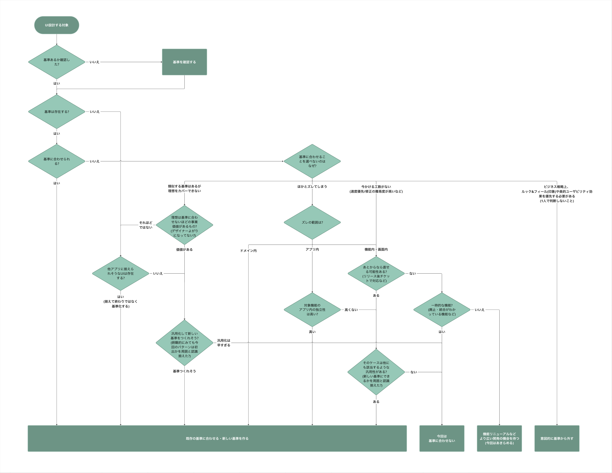

UIデザイン使用性チェックリストは、SmartHRのプロダクトデザイナーが日本産業規格（JIS X 25000シリーズ）を参考に開発した、[プロダクトの使用性](/products/usability/#h2-0)という「ユーザーがプロダクトをどのくらい使えるかの品質」を担保するための、UIデザイン時点で考慮すべき観点の一覧です。

以下、UIデザイン使用性チェックリストを「使用性チェックリスト」と省略表記します。

## 日本産業規格（JIS）との関係
使用性チェックリストは、プロダクトのユーザビリティが確保されることをより客観的に示すために、国家規格である日本産業規格の「[JIS X 25000シリーズ（SQuaREシリーズ）](https://webdesk.jsa.or.jp/books/W11M0090/index/?bunsyo_id=JIS+X+25000%3A2017)」を参考にして開発されています。※

- <small>※ ユーザビリティに関する規格として、ソフトウェア製品の品質・評価に関する国際規格（ISO/IEC 25000シリーズ）の国内版 JIS X 25000シリーズの定義を採用</small>

JIS X 25000シリーズで定義されている「使用性」の特性や測定基準を利用することで、チェックする観点の偏りや独自性を低減しながら「**プロダクトとしての使いやすさを、JISで規定された製品品質の使用性を元にした観点によって、一定確保したUIデザインをしている**」という説明責任を果たすツールとなり、使いやすさをより客観的に担保できることを目指しています。

## できること
- プロダクトデザイナーは、UIデザイン作業時に使用性チェックリストを利用することで、操作性や一貫性を確保したUIデザインができているかの確認（セルフチェック）や、デザインレビュー時の説明に役立てられます。
- 他のプロダクトデザイナーが作成したデザインカンプに対して、レビューする際の観点や指摘の根拠に使えます。
- プロダクトデザイナー以外のステークホルダーは、使用性チェックリストの結果を確認することで、プロダクトの「UIデザイン時点でのユーザビリティの品質（プロダクトの使用性）」を客観的に把握できます。

## チェック内容
使用性チェックリストには、2023年11月現在、21項目のチェック内容があります。  
今後の活用によって、チェックリストは随時更新される可能性があります。

import { Table, Th, Td } from 'smarthr-ui'
import TableReel from './_components/TableReel'

<TableReel>
<Table>
<thead>
<tr>
    <Th contentWidth={1}>#</Th>
    <Th contentWidth={4} style={{ minWidth: '4em' }}>カテゴリ</Th>
    <Th style={{ minWidth: '20em' }}>チェック内容</Th>
    <Th contentWidth={6} style={{ minWidth: '6em' }}>チェック内容 の達成基準</Th>
    <Th contentWidth={16}>関連する品質測定量 （JIS X 25023:2018）</Th>
    <Th contentWidth={11}>関連する副特性 （JIS X 25010:2013）</Th>
</tr>
</thead>
<tbody>
<tr>
    <Td>1</Td>
    <Td>情報設計</Td>
    <Td>ユーザーの業務を説明する</Td>
    <Td>[達成基準1](#h4-0)</Td>
    <Td>`UOp-7-S 情報の理解可能な分類`</Td>
    <Td>運用操作性</Td>
</tr>
<tr>
    <Td>2</Td>
    <Td>情報設計</Td>
    <Td>概念モデルを説明する</Td>
    <Td>[達成基準1](#h4-0)</Td>
    <Td>`UOp-7-S 情報の理解可能な分類`</Td>
    <Td>運用操作性</Td>
</tr>
<tr>
    <Td>3</Td>
    <Td>情報設計</Td>
    <Td>オブジェクトに付随するプロパティとアクションはユーザーの業務の遂行に十分なものであることを説明する</Td>
    <Td>[達成基準1](#h4-0)</Td>
    <Td>`UOp-7-S 情報の理解可能な分類`</Td>
    <Td>運用操作性</Td>
</tr>
<tr>
    <Td>4</Td>
    <Td>情報設計</Td>
    <Td>ビューの呼び出し関係を説明する</Td>
    <Td>[達成基準1](#h4-0)</Td>
    <Td>`UOp-7-S 情報の理解可能な分類`</Td>
    <Td>運用操作性</Td>
</tr>
<tr>
    <Td>5</Td>
    <Td>情報設計</Td>
    <Td>メインナビゲーションはユーザーの関心に沿って分類されていることを説明する</Td>
    <Td>[達成基準1](#h4-0)</Td>
    <Td>`UOp-7-S 情報の理解可能な分類`</Td>
    <Td>運用操作性</Td>
</tr>
<tr>
    <Td>6</Td>
    <Td>デザインパターン</Td>
    <Td>「[視線誘導](/products/design-patterns/visual-guidance/)」の基準に沿っているか（見出しや色を適切に使用した画面全体の情報の流れ・強弱を表現できているか）</Td>
    <Td>[達成基準2](#h4-1)</Td>
    {/* textlint-disable */}
    <Td>`UIn-1-S ユーザインタフェースの外観の快美性`</Td>
    <Td>ユーザインタフェース快美性、アクセシビリティ</Td>
    {/* textlint-enable */}
</tr>
<tr>
    <Td>7</Td>
    <Td>デザインパターン</Td>
    <Td>「[視覚的グルーピング](/products/design-patterns/visual-grouping/)」の基準に沿っているか（色を適切に使用した視覚的グルーピングを含む）</Td>
    <Td>[達成基準2](#h4-1)</Td>
    {/* textlint-disable */}
    <Td>`UOp-1-G 操作一貫性` `UOp-8-S 外観の一貫性` `UIn-1-S ユーザインタフェースの外観の快美性`</Td>
    <Td>運用操作性、ユーザインタフェース快美性、アクセシビリティ</Td>
    {/* textlint-enable */}
</tr>
<tr>
    <Td>8</Td>
    <Td>デザインパターン</Td>
    <Td>「[ページレイアウト](/products/design-patterns/page-layout/)」の基準に沿っているか（機能のトップとなるページに適切なリード文が書かれているか、を含む）</Td>
    <Td>[達成基準2](#h4-1)</Td>
    {/* textlint-disable */}
    <Td>`UOp-1-G 操作一貫性` `UOp-8-S 外観の一貫性` `UAp-3-S ウェブサイト目的説明率` `UIn-1-S ユーザインタフェースの外観の快美性`</Td>
    <Td>運用操作性、適切度認識性、ユーザインタフェース快美性</Td>
    {/* textlint-enable */}
</tr>
<tr>
    <Td>9</Td>
    <Td>デザインパターン</Td>
    <Td>「[余白の取り方](/products/design-patterns/spacing-layout-pattern/)」の基準に沿っているか</Td>
    <Td>[達成基準2](#h4-1)</Td>
    {/* textlint-disable */}
    <Td>`UOp-1-G 操作一貫性` `UOp-8-S 外観の一貫性` `UIn-1-S ユーザインタフェースの外観の快美性`</Td>
    <Td>運用操作性、ユーザインタフェース快美性</Td>
    {/* textlint-enable */}
</tr>
<tr>
    <Td>10</Td>
    <Td>デザインパターン</Td>
    <Td>「[モバイルレイアウト](/products/design-patterns/mobile-friendly-layout/)」の基準に沿っているか</Td>
    <Td>[達成基準2](#h4-1)</Td>
    <Td>`UOp-1-G 操作一貫性` `UOp-8-S 外観の一貫性`</Td>
    <Td>運用操作性、アクセシビリティ</Td>
</tr>
<tr>
    <Td>11</Td>
    <Td>デザインパターン</Td>
    <Td>ユーザーへの通知・フィードバックの出し方が「[フィードバック](/products/design-patterns/feedback/)」の基準に沿っているか</Td>
    <Td>[達成基準2](#h4-1)</Td>
    <Td>`UOp-1-G 操作一貫性` `UOp-8-S 外観の一貫性` `UOp-2-G メッセージ明確性`</Td>
    <Td>運用操作性、アクセシビリティ</Td>
</tr>
<tr>
    <Td>12</Td>
    <Td>デザインパターン</Td>
    <Td>モードがあるUIの場合は、「[モーダルなUI](/products/design-patterns/modal-ui/)」の基準に沿っているか</Td>
    <Td>[達成基準2](#h4-1)</Td>
    <Td>`UOp-1-G 操作一貫性` `UOp-8-S 外観の一貫性`</Td>
    <Td>運用操作性</Td>
</tr>
<tr>
    <Td>13</Td>
    <Td>デザインパターン</Td>
    <Td>テーブルを使う場合は、「[よくあるテーブル](/products/design-patterns/smarthr-table/)」の基準に沿っているか</Td>
    <Td>[達成基準2](#h4-1)</Td>
    <Td>`UOp-1-G 操作一貫性` `UOp-8-S 外観の一貫性`</Td>
    <Td>運用操作性</Td>
</tr>
<tr>
    <Td>14</Td>
    <Td>デザインパターン</Td>
    <Td>入力要素が「[デフォルト値](/products/design-patterns/default_value/)」の基準に沿っているか</Td>
    <Td>[達成基準2](#h4-1)</Td>
    <Td>`ULe-2-S 入力欄のデフォルト`</Td>
    <Td>習得性</Td>
</tr>
<tr>
    <Td>15</Td>
    <Td>デザインパターン</Td>
    <Td>エラー状態（Error state）が検討されており、エラーを回復・解消できるような[フィードバック](/products/design-patterns/feedback/)の出し方が考慮されているか</Td>
    <Td>[達成基準2](#h4-1)</Td>
    {/* textlint-disable */}
    <Td>`UEp-3-S ユーザエラー回復性`</Td>
    <Td>ユーザエラー防止性、アクセシビリティ</Td>
    {/* textlint-enable */}
</tr>
<tr>
    <Td>16</Td>
    <Td>デザインパターン</Td>
    <Td>削除含む危険な操作、やり直しができない操作の前に、[ワンクッション](/products/design-patterns/confirmation-step/)はさんでいるか</Td>
    <Td>[達成基準2](#h4-1)</Td>
    {/* textlint-disable */}
    <Td>`UOp-6-S 操作実行取消し能力` `UEp-1-G 利用者操作エラー回避性`</Td>
    <Td>運用操作性、ユーザエラー防止性</Td>
    {/* textlint-enable */}
</tr>
<tr>
    <Td>17</Td>
    <Td>コンポーネント</Td>
    <Td>SmartHR UIと類似した独自のコンポーネントになっていないか</Td>
    <Td>[達成基準2](#h4-1)</Td>
    <Td>`UOp-1-G 操作一貫性` `UOp-8-S 外観の一貫性`</Td>
    <Td>運用操作性</Td>
</tr>
<tr>
    <Td>18</Td>
    <Td>コンポーネント</Td>
    <Td>各[コンポーネント](/products/components/)の基準に沿った利用方法をしているか</Td>
    <Td>[達成基準2](#h4-1)</Td>
    <Td>`UOp-1-G 操作一貫性` `UOp-8-S 外観の一貫性`</Td>
    <Td>運用操作性、アクセシビリティ</Td>
    
</tr>
<tr>
    <Td>19</Td>
    <Td>ライティング</Td>
    <Td>SmartHRの基本的な概念（用語）に合わせた命名をしているか</Td>
    <Td>[任意](#h3-5)</Td>
    <Td>`UOp-1-G 操作一貫性` `UOp-8-S 外観の一貫性`</Td>
    <Td>運用操作性</Td>
</tr>
<tr>
    <Td>20</Td>
    <Td>ライティング</Td>
    <Td>操作の導線やアクション名が[ライティング](/products/contents/)の基準に沿っているか</Td>
    <Td>[任意](#h3-5)</Td>
    <Td>`UOp-1-G 操作一貫性` `UOp-8-S 外観の一貫性`</Td>
    <Td>運用操作性</Td>
</tr>
<tr>
    <Td>21</Td>
    <Td>ライティング</Td>
    <Td>「[エラーメッセージ](/products/contents/ui-text/error-messages/)」の基準に沿っているか</Td>
    <Td>[達成基準2](#h4-1)</Td>
    <Td>`ULe-3-S エラーメッセージ理解性` `UEp-2-S 利用者入力エラーの訂正`</Td>
    {/* textlint-disable */}
    <Td>習得性、ユーザエラー防止性、アクセシビリティ</Td>
    {/* textlint-enable */}
</tr>
<tr>
    <Td>22</Td>
    <Td>アクセシビリティ</Td>
    <Td>[アクセシビリティ簡易チェックリスト](/accessibility/check-list/)を用いてデザインファイルをチェックしたか</Td>
    <Td>[達成基準2](#h4-1)</Td>
    <Td>`UAc1G 障害のある利用者に対するアクセシビリティ`</Td>
    <Td>アクセシビリティ</Td>
</tr>
</tbody>
</Table>
</TableReel>

### 表頭の説明
表の各項目の説明は以下のとおりです。

{/* textlint-disable */}
- `カテゴリ`
    - [プロダクトの項目](/products/)のカテゴリ
- `チェック内容`
    - 使用性を確保するためにチェックする項目。多くの項目が「〜〜の基準に沿っているか」を確認する。
- `達成基準`
    - チェック内容を[達成するための基準](#h3-1)へのリンク
- `関連する品質測定量`
    - チェック内容に関連付けられた品質測定量（JIS X 25023:2018 システム及びソフトウェア製品の品質の測定 より）
- `関連する使用性の副特性`
    - 品質測定量が属する使用性の副特性（JIS X 25010:2013 システム及びソフトウェア品質モデル より）
{/* textlint-enable */}

### 達成基準
カテゴリに応じて各チェック内容を達成する基準を設定しています。

#### 1. 情報設計カテゴリの達成基準
- [情報設計のアウトプット](/products/design-review/ia-review/ia-outputs/)を作成していること
- 対象となる開発プロジェクトは、[情報設計レビュー](/products/design-review/ia-review/)を実施していること

#### 2. その他のカテゴリの達成基準

import UsabilityCheckListWarning from './_components/UsabilityCheckListWarning'

<UsabilityCheckListWarning />

- チェック内容にある基準に則っていること
    - 基準に則っていない場合、[基準判断フローチャート](#h3-6)などを活用して説明可能であること
- 対象となる開発プロジェクトは、[UIレビュー](/products/design-review/ui-review/)を実施していること

## SmartHRにおける運用
### 利用対象者
主にプロダクトデザイナーを想定していますが、プロダクトデザイナーに限らず以下のような人を対象としています。

- デザインカンプ作成など、SmartHRプロダクトのUIデザインをする人
- デザインレビューで他者のアウトプットをレビューする人

### 期待される効果
- 利用対象者のアウトプットの品質向上
- マルチプロダクトとしてのUIの一貫性の向上
- デザインレビュー品質の向上
- デザインシステムの品質向上（イシューの可視化）

### 利用方法
利用対象者は、共通認識として**あらかじめ使用性チェックリストの内容を把握しておいてください。**

- UIデザイン作業時、随時[チェック手順](#h3-5)にしたがって確認する。（セルフチェック）
    - 基準に合わせることに悩むケースでは、[基準判定フローチャート](#h3-6)を参照して基準に合わせるかの判断に活用する。
- デザインレビュー時に「なぜそのようにしたか」を、チェックの結果や基準判定フローチャートを活用して説明する。

### チェック手順
チェックは「[UIデザイン使用性チェックリスト回答テンプレート(Googleスプレッドシート)](https://docs.google.com/spreadsheets/d/14dBtQRFoo1OCTs-0sz0FFePFtE0olC59ANHTIbDYYbA/edit?usp=sharing)」を複製して使用してください。

<UsabilityCheckListWarning />

1. **情報設計の項目を確認し、`チェック内容への回答`列を選択する。**
    - 「はい」の場合
        - `説明・証明する中間成果物`列に説明を記入するか、中間成果物のリンクなどを貼る。
    - 「いいえ」の場合
        - `中間成果物を作らない理由`列を書く。
2. **デザインパターン、コンポーネント、ライティングの項目を確認し、`チェック内容への回答`列を選択する。**
    - 「はい」の場合（基準に沿っている場合）
        - 対応不要
    - 「いいえ」の場合（基準に沿っていない場合）
        - [基準判定フローチャート](#h3-6)を参照し、改めて基準に合わせるべきかを検討する。
        - `基準に合わせられない理由`列に判断の理由を書く。
    - 「基準がない」の場合
        - [基準判定フローチャート](#h3-6)を参照し、基準を作るべきかを検討する。
        - `UIデザインの意思決定の背景`列に、どのような考え方で現状のUIデザインに至ったかを書く。
        - レビュー会などで現状のUIデザインが妥当かを検討する。

### 基準判定フローチャート
開発現場においては、チェック内容の基準に合わせられない状況は頻繁に発生します。  
例えば、以下のようなケースです。

- 基準に合っていない既存プロダクトに機能追加する必要があり、基準に合わせると既存とズレてしまう場合
- 開発チームで理想とするUIを検討したが、基準ではカバーできていない場合
- ビジネス戦略上、ルック・アンド・フィールを追求する必要がある場合

基準判定フローチャートは、このような状況を客観的に分析し「基準に合わせるべきか・あえて合わせない方がよいか」の判断を支援するためのツールです。

また、フローチャートをどのように辿ったかを説明することで、他者に自身の判断プロセスを伝えることにも役立てられます。

## 更新履歴
- 2025/12/12：使用性チェックリストにアクセシビリティに関する項目（No.22）を追加